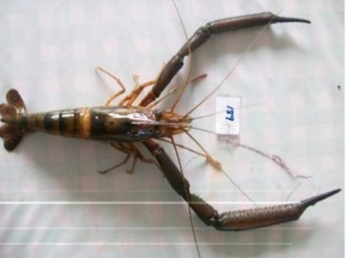
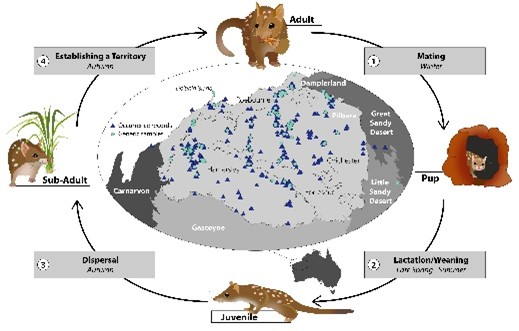

```{r setup, include=FALSE}
knitr::opts_chunk$set(
	echo = TRUE,
	message = FALSE,
	warning = FALSE
)

#necessary to render tutorial correctly
library(learnr) 
library(htmltools)
#options(repos = BiocManager::repositories())
library(dartR.data)
library(dartR.base)
library(dartR.sexlinked)
gl.set.verbosity(3)

#library(dartRintro) # for tutorial data
source('./www/reassign_ind_function.R')
library(dartRstartup)

```


## Main menu {#custom data-progressive="FALSE"}

It is time to start working in the dartRverse! Welcome!

This is your hands on introduction to [dartR](https://github.com/green-striped-gecko/dartRverse?tab=readme-ov-file#dartrverse-). The worked examples and exercises in this tutorial correspond to the [[Getting Started with dartR ebook](http://dartr.biomatix.org/dartR)]{style="color:#ff0000;"}. There are also accompanying [AI podcast summaries](https://public.3.basecamp.com/p/Dp1F2egZGXY5siDf1MPFqyyg) for all the chapters, which you should definitely check out if you are more of an auditory learner.


### Worked examples and exercises 

The first part of this tutorial are the worked examples, where we walk you through the process step by step. Following the worked examples you will get the chance to test your knowledge with the exercises, using real data to process datasets that have been used in scientific literature! 

**List of worked examples:**

- [Worked Ex 2-1: Data Structures] *optional*

- [Worked Ex 2-2: I/O] *optional*

- [Worked Ex 2-3: Controlling Workflow] *optional*

- [Worked Ex 2-4:Functions] *optional*

- [Worked Ex 3-1: Data Structures and I/O]

- [Worked Ex 4-1: Basic Attributes and QC]

- [Worked Ex 4-2: Manipulating data]

- [Worked Ex 5-1: Filtering]

- [Worked Ex 6-1: Exploratory Visualization]

**Exercises**

- [Worked Example Exercises]

- [Exercise 7-1: Camaroon Macrobrachium]

- [Exercise 7-2: Western Sawshell Turtle]

- [Exercise 7-3: Northern Quoll]


Don't forget that all aspects of the material are beneficial for learning. The ebook for being introduced to the theory and methods, the worked examples to gain experience in the application, and finally the exercises to apply everything you have learned.

<small>If you can't see the left sidebar, you just need to make the tutorial panel wider.</small>

### R code box

Throughout this tutorial there will be interactive R scripts/consoles (like the one below). This is like a mini version of R running within this tutorial. But since we are already in R, you can also follow along in your own console and start writing your own code in the source panel. You could even try testing some of what you learn on your own data.

But first, try running the code below (press the button that says *run code*)

```{r ex, exercise=TRUE}
# Press the Run Code button to run this code
1+1
```

It is worth noting that each R code box is independent, so code you ran in one will not be recognised by another. Don't worry though, we have done some fancy coding in the background for you to continue along, keeping track of the tasks performed before hand when necessary. 

Some of the exercises within this tutorial are specific to your working environment or Rstudio, these types of exercises will have the code provided for you to run in your R session, along with the output.

While going through the worked examples your progress will be saved, if at any point you would like to refresh the tutorial and start over, the <small>[Start Over]{style="color:#a3a3a3; font-family:'Jaldi', sans-serif;"}</small> button is located at the bottom of the left sidebar, below the tutorial content.

### Google group

Any troubles or tribulations with coding in dartR, we have a great community that can be found on the [dartR google group](https://groups.google.com/g/dartr).

### Let's get started! 

Alright! Time to get started with your first worked example. After that head back to the ebook and be ready to work through the worked examples and exercises back here when prompted.

<p>Good luck on your Pop Gen journey! 😁</p>


## Worked Ex 2-1: Data Structures

### Objects in R

R works with objects, that is, with self-contained entities that have defined attributes. These entities may be a scalar value, a vector of values, a matrix or even a function. The advantage of objects is that when you use one in calculations, R knows what it is and how to handle it in the calculations.

When you create an object in R, attributes are assigned to it by default. The decision is made behind the scenes.


```{r ex21a, exercise = TRUE}
x <- 12
class(x)
```


```{r ex21b, exercise = TRUE}
x <- "pumkin"
class(x)
```

### Scalars

A Scalar is an object that contains a single value. It could be a number, or a character string, or a logical variable (`TRUE` or `FALSE`).


```{r ex21c, exercise = TRUE}
# Character scalar
chr <- "Juvenile"
chr
class(chr)
```

```{r  ex21d, exercise = TRUE}
# Numeric scalar
num <- 6
num
class(num)
```

```{r  ex21e, exercise = TRUE}
# Logical scalar
log <- TRUE
log
class(log)
```

### Vectors

A vector is an object containing an ordered set of values all of the same type. Vectors are the fundamental building blocks of data in R so we visit vectors in some detail here.

#### Creating Vectors

Use the `c()` function (which stands for "combine" or "concatenate") to create vectors of class character, numeric, or logical.


```{r ex21f, exercise = TRUE}
# Character vector (text)
names <- c("Alice", "Bob", "Carol", "Dave")
names
```

```{r ex21g, exercise = TRUE}
# Numeric vector
temperatures <- c(72, 68, 75, 71, 69)
temperatures
```

```{r ex21h, exercise = TRUE}
# Logical vector (TRUE/FALSE)
test_results <- c(TRUE, FALSE, TRUE, TRUE)
test_results
```

###

On occasion, you may wish to initialize a vector to be populated during later computation. This can be done with

```{r ex21i, exercise = TRUE}
# Initializing an empty vector
vec <- vector("logical", 20) # Creates logical NAs 
vec[] <- NA # Explicitly set all to NA 
vec 
```

###

Note: In R, even scalar values are vectors

```{r ex21j, exercise = TRUE}
single_value <- 42
is.vector(single_value)
length(single_value)
```

###
#### Accessing Vector Elements

```{r data2, echo = FALSE}
width <- c(10.4,5.6,3.1,6.4,21.7)
names <- c("Alice", "Bob", "Carol", "Dave")
vec <- c(1, 2, NA, 4, 5)
sexcode <- c("F", "F", "M", "J", "F", "M", "J", "J", "F")
mat <- matrix(NA, nrow = 3, ncol = 4) 
```


```{r eval = FALSE}
# Create a vector
width <- c(10.4,5.6,3.1,6.4,21.7)
# Access a single element
width[4]

# Access multiple specific elements
width[c(1,3,4)]

# Access consecutive elements using colon
width[1:4]

# Access all except specified elements (negative indexing)
width[c(-2,-5)]

# Access first and last elements
width[c(1,length(width))]

# Access elements greater than 6 
width[width > 6]

# Create a vector
names <- c("Alice", "Bob", "Carol", "Dave")
# Access elements equal to specific values 
names[names == "Alice"] 

```

Try accessing different elements using the example code above.

```{r ex21q,  exercise = TRUE, exercise.setup = "data2"}
width <- c(10.4,5.6,3.1,6.4,21.7)
width[]

```

```{r ex21qqx,  exercise = TRUE, exercise.setup = "data2"}
names <- c("Alice", "Bob", "Carol", "Dave")
names[]

```

###

You should by now have the gist. A vector is a data structure that holds an ordered set of numbers, each of which can be addressed by its position in the ordered set, or by applying some logical condition, using square brackets.

###

#### Vector arithmetic

The normal rules of arithmetic apply to vectors in the sense that they apply to each element of the vector (note that it is not at all like vector arithmetic in the mathematical sense).

```{r ex21r,  exercise = TRUE, exercise.setup = "data2"}
width <- width + 10
width
```

###

This will add 10 to each value of the vector. Similar actions occur with the other arithmetic operators. The functions `log()`, `exp()`, `sin()`, `cos()`, `tan()`, `sqrt()`, and so on, all have their usual meaning, and when applied to a vector, are applied to each value of the vector.

It is possible to include two vectors in calculations, in which case their values will be included in the equation as matched pairs. For example, if we have two vectors with the same number of values, length and width, then the assignment

```{r ex21s,  exercise = TRUE, exercise.setup = "data2"}
length <-  c(2,1,3,2,10)
area <- length*width
area
```

###

This will yield a new vector with the values calculated by multiplying the first value of length with the first value of width, the second value of length with the second value of width, and so on. Calculations involving missing values NA will yield missing values.

The standard arithmetic operators apply, and include and include the usual addition (`+`), subtraction (`-`), division (`/`), multiplication (`*`) and exponentiation (`^`). 
Working with vectors of differing sizes is difficult, and we probably should not go there.

###

#### Missing Values in Vectors

Missing values are represented by the special keyword NA.

```{r ex21t,  exercise = TRUE, exercise.setup = "data2"}
vec <- c(1, 2, NA, 4, 5)
vec
```


```{r ex21u,  exercise = TRUE, exercise.setup = "data2"}
# Check for missing values
is.na(vec)
```


```{r ex21v,  exercise = TRUE, exercise.setup = "data2"}
# Remove missing values
vec2 <- vec[!is.na(vec)]
vec2
```

###

#### Useful Vector Functions


```{r eval = FALSE}
numbers <- c(1, 5, 2, 2, 8, 1, 9, 3)
length(numbers)    # Number of elements

sum(numbers)       # Sum of all elements  

mean(numbers)      # Average

max(numbers)       # Maximum value

min(numbers)       # Minimum value

sort(numbers)      # Sort in ascending order

unique(numbers)    # Remove duplicates
```

Try them in the code box below:

```{r ex21w,  exercise = TRUE, exercise.setup = "data2"}
numbers <- c(1, 5, 2, 2, 8, 1, 9, 3)
length(numbers) # e.g.

```


```{r ex21w-hint}
# copy and paste from above, one at a time or all at once.
```

###

For a more detailed account of working with vectors in R, refer to the [AI summary on vectors](http://georges.biomatix.org/storage/app/media/eBook Introduction to dartR/AI_Guide_to_R_Vectors.htm).

### Factors

Factors are are special types of vectors whose values have labels associated with them. For example, we might create a character vector containing a combined sex and maturity code for animals caught on a particular day.

```{r ex21aa,  exercise = TRUE, exercise.setup = "data2"}
sexcode <- c("F", "F", "M", "J", "F", "M", "J", "J", "F")
sexcode
```

###

Converting this to a factor causes the values, in alphabetical order, to be assigned numbers, and those numbers to be assigned labels. 

```{r ex21bb,  exercise = TRUE, exercise.setup = "data2"}
sexcode <- factor(sexcode)
sexcode
```

###

A subtle difference to be sure. The numbers are hidden behind the scenes, and re-caste with their character values by R when they are printed out. That they are stored as numbers is evident when we print the object sexcode out without reference to its class.

```{r ex21cc,  exercise = TRUE, exercise.setup = "data2"}
unclass(factor(sexcode))
```

###

The subtle difference between a character vector and a factor will become evident in analyses that involve discrete factors.
To convert a character factor to a character vector, use

```{r ex21dd,  exercise = TRUE, exercise.setup = "data2"}
sexcode <- as.character(sexcode)
sexcode
```

###

To convert a numeric factor to a numeric vector, use

```{r ex21ee,  exercise = TRUE, exercise.setup = "data2"}
width <- as.numeric(as.character(width))
width
```

###

For a more detailed account of working with factors in R, refer to the [AI summary on factors](http://georges.biomatix.org/storage/app/media/eBook Introduction to dartR/AI_Guide_to_R_Factors.htm).

### Matricies

A matrix is a two-dimensional array of data arranged in rows and columns, where all elements must be of the same data type (all numbers, all text, or all logical values). 
Creating Matrices

Matrices are usually created by inputting data from a spreadsheet (refer section on I/O).
On occasion, you may wish to initialize a matrix to be populated during later computation. This can be done with

```{r ex21ff,  exercise = TRUE, exercise.setup = "data2"}
# Initializing an empty Matrix
mat <- matrix(NA, nrow = 3, ncol = 4) 
mat
```

###

#### Adding row and column names to a matrix

```{r ex21gg,  exercise = TRUE, exercise.setup = "data2"}
# Add row names 
rownames(mat) <- c("Row1", "Row2", "Row3") 
# Add column names 
colnames(mat) <- c("Col1", "Col2", "Col3", "Col4") 
mat

```

###

#### Accessing Matrix Elements

As with vectors, square brackets are used to access matrix elements. Note that the indexing begins with 1 (not zero as in many programming languages) and that the first index value refers to rows and the second to columns.

```{r data3, echo = FALSE}
mat <- matrix(1:12, nrow = 3, ncol = 4)
```


```{r eval = FALSE}
# Create a matrix
mat <- matrix(1:12, nrow = 3, ncol = 4)
mat

# Access element in row 2, column 3
mat[2,3]

# Get entire row 2 (leave column position empty)
mat[2,]

# Get entire column 3 (leave row position empty)
mat[,3]

# Get multiple rows
mat[c(1,3),]

# Get multiple columns
mat[,c(2,4)]

```

Try accessing different elements using the example code above.

```{r  ex21mm,  exercise = TRUE, exercise.setup = "data3"}
mat <- matrix(1:12, nrow = 3, ncol = 4)
mat[]
```


### Arrays

An array is a multi-dimensional data structure that can have more than two dimensions (unlike matrices which are strictly two-dimensional). Think of arrays as extending the concept of matrices to three, four, or more dimensions. All elements in an array must be of the same data type. Each element can be accessed by specifying its position in each dimension.

For a more detailed account of working with matrices and arrays in R, refer to the [AI summary on matrices](http://georges.biomatix.org/storage/app/media/eBook Introduction to dartR/AI_Guide_to_R_Matrices.htm) and the [AI summary on arrays](http://georges.biomatix.org/storage/app/media/eBook Introduction to dartR/AI_Guide_to_R_Arrays.htm).

### Dataframes

Dataframes are a central plank of data structures in R. Data frames organize data in rows and columns, just like Excel spreadsheets. Each row typically represents one entity and each column typically represents an attribute for that entity.

Unlike matrices (which require all elements to be the same type), data frames can have different data types in different columns. You might have names as text in one column, weights as numbers in another, and test results as TRUE/FALSE values in a third column.

#### Importing Data to a Dataframe

Dataframes are usually created by inputting data from a text file or csv file.

- [`r xfun::embed_file("./www/my_input.dat", name = "my_input.dat", text = "my_input.dat")`]{style="color:#cc9900;"} : This is a simple text file. Let’s start by downloading it into your project folder so we can then import the data.

```{r eval =FALSE}
df <- read.table("my_input.dat", header=FALSE)
```

```{r echo=FALSE}
df <- read.table("./www/my_input.dat", header=FALSE)
```

This statement assigns the data in the raw datafile [my_input.dat]{style = "color: blue;"} to the dataframe `df`. 

To examine the contents of the dataframe to see if it has been input correctly, simply type the dataframe name.


```{r datatab}
df <- turtles.df
```

```{r ex21nn,  exercise = TRUE, exercise.setup = "datatab"}
df
```

###

Note the missing value for sex of the juveniles. Character variables are read in as factors, not as character vectors. In this case, the variable sex will be read in as a factor with the factor levels MALE and FEMALE.

###

#### Adding column names to a dataframe

Sometimes data are held in a file without variable names. We can read these data in and give the variables names subsequently.

```{r ex21oo,  exercise = TRUE, exercise.setup = "datatab"}
names(df) <- c("identity","sex","len","hw","wt")
df
```

###

```{r datatab2}
df <- turtles.df
names(df) <- c("identity","sex","len","hw","wt")

```

#### Accessing DataFrame elements

DataFrame columns can be accessed as vectors using the `$` operator


```{r ex21pp,  exercise = TRUE, exercise.setup = "datatab2"}
df$sex
```

and specific values in a column using

```{r ex21qq,  exercise = TRUE, exercise.setup = "datatab2"}
df$sex[7]
```


The object `df$sex` is a vector, and all the usual operators for vectors apply. 

###

#### Initializing a DataFrame

Sometimes you need to initialize a DataFrame populated with missing values to be later accessed and populated with useful values.

```{r}
# Initialize a DataFrame with 10 rows, 4 columns 
df <- data.frame(matrix(NA, nrow = 10, ncol = 4))
names(df) <- c("temperature", "humidity", "pressure", "wind_speed")
df 
```


###

#### Adding Rows and Columns to a Dataframe

The simplest way to add a new variable (=column) to an existing dataframe is to use assignment.

```{r}
df <- data.frame(matrix(NA, nrow = 10, ncol = 4))
df$newvar <- 1:10
df
```

The length of the vector needs to be the same as the number of rows in the dataframe.

Alternatively, `cbind()` which can be used to add vectors to a dataframe as new variables. These vectors need to be the same length as the variables already in the dataframe.

The `rbind()` function can be used to join two like dataframes together, one to follow the other, or to bind a vector to a dataframe as an additional row. The vector needs to be of the same length as the number of columns in the dataframe, and to have data of appropriate type in each column. Character variables in a dataframe are often considered factors and their values as factor levels. Any character values added may need to have compatible factor levels.

For a more detailed account of working with dataframes in R, refer to the [AI summary on dataframes](http://georges.biomatix.org/storage/app/media/eBook%20Introduction%20to%20dartR/AI_Guide_to_R_Data_Frames.htm).

### Lists

A list is R's most flexible data structure – it is an object that itself can hold a set different types of objects (vectors, matrices, data frames, even other lists) all together. Unlike vectors, matrices, or data frames that require elements to be the same type or have the same structure, lists can contain completely different kinds of objects with completely different types of data.

The elements of a list are in a specific order and position, for easy reference. The elements can be named or un-named. Lists can contain other lists among their elements. The elements of a list do not have to be the same size.

#### Creating a List

```{r}
# Create a scalar
sample_size <- 50
# Create a character vector
genotype <- c("A/A", "A/B", "A/B", "B/B")
# Create a numeric vector
frequencies <- c(0.5, 0.2, 0.8, 0.1, 0.7)
# Create a date scalar
experiment_date <- as.Date("2024-03-15") 
# Create a logical scalar value
significance <- TRUE
# Create a list
exp_results <- list(n=sample_size, genotype=genotype, 
                    frequencies=frequencies,
                    date=experiment_date,
                    sig=significance)
exp_results

```


```{r datalist, echo = FALSE}
sample_size <- 50
# Create a character vector
genotype <- c("A/A", "A/B", "A/B", "B/B")
# Create a numeric vector
frequencies <- c(0.5, 0.2, 0.8, 0.1, 0.7)
# Create a date scalar
experiment_date <- as.Date("2024-03-15") 
# Create a logical scalar value
significance <- TRUE
# Create a list
exp_results <- list(n=sample_size, genotype=genotype, 
                    frequencies=frequencies,
                    date=experiment_date,
                    sig=significance)
exp_results
```

###

#### Accessing List Elements
List elements can be accessed with a double square bracket. For example, to pull down the genotype into a vector, use

```{r ex21ss,  exercise = TRUE, exercise.setup = "datalist"}
vec <- exp_results$genotype
vec
```

We will see later that lists are particularly valuable in passing multiple objects back from an R function.

#### Initializing a list
Sometimes you will need to initialize a list before populating it, such as in a for loop.

```{r ex21tt,  exercise = TRUE, exercise.setup = "datalist"}
sample_list <- list()
class(sample_list)
```


#### Adding new elements to a list
You can add new elements to an existing list by assignment.

```{r ex21uu,  exercise = TRUE, exercise.setup = "datalist"}
# Add a new object called weights
weights <- c(3.5, 5.2, 7.8, 4.1, 6.7)
exp_results[["wt"]] <- weights
exp_results
```

###

For a more detailed account of working with lists in R, refer to the [AI summary on lists](http://georges.biomatix.org/storage/app/media/eBook Introduction to dartR/AI_Guide_to_R_Lists.htm).

### How R Handles Missing Values

We have learned that the keyword NA is recognised by R as a missing value. Some R commands take into account missing values, such as summary(), while others do not, such as mean().
Do not use the string "NA" to represent missing data in your program statements. Use the keyword NA. So an appropriate assignment of the fourth value of the vector weight to missing is

```{r}
weights <- c(3.5, 5.2, 7.8, 4.1, 6.7)
weights[4] <- NA
```
	
and not
	

```{r eval=FALSE}
weights[4] <- "NA"
```

The function `is.na()` is used to determine which values of a variable are missing and which have data. For example,

```{r}
is.na(weights)
```

Many R functions have an option to specify whether or not to exclude missing values from computations, for example

```{r}
mean(weights,na.rm=TRUE)
```


### Winding up

You have now finished Worked Example 2-1 so return to the eBook for further instructions, or return to the MAIN MENU to select the next worked example.


[Back to Menu](#custom){.menuButton}


## Worked Ex 2-2: I/O

A core skill in scientific computing is the ability to import experimental data into R and export results for reporting, collaboration, or downstream analysis. R supports a wide range of data formats commonly used in laboratories, field studies, and bioinformatics pipelines. In this worked example, we illustrate standard approaches for both input (reading data) and output (writing data), using small, reproducible examples.

### Input: Reading data into R
There are several common methods for loading data into R, each suited for different data formats and sources. below are the most widely used approaches. The object that receives the data is typically a dataframe.

#### Reading a CSV File

CSV Files are the most common format for scientific data exchange. They comprise rows with the values to be assigned to each column separated by commas. 

Download to your working directory, a csv file containing metadata for individuals to be used in later analyses. It is called [Tympo_ind_metadata.csv]{style ="color: blue;"}.

Forgotten the path to your working directory?

```{r}
getwd()
```

The `read.csv()` function is the standard method for reading in csv files.

```{r eval=FALSE}
# Loading Tympanocryptis metadata as csv
metadata <- read.csv("Tympo_ind_metadata.csv")
```


```{r datainput, echo = FALSE, cache=FALSE}

metadata <- read.csv("./www/Tympo_ind_metadata.csv")


```


The `read.csv()` family of functions offers important parameters for scientific data: `na.strings` to specify how missing values are coded, `stringsAsFactors` to control text handling, and `skip` to ignore header information common in instrument output files. Access help for more information on options.

```{r eval=FALSE}
?read.csv
```

Having read the data in, examine the first 10 records.

```{r}
metadata[1:10,]
```


#### Reading an Excel File
We will not demonstrate it here, but you can also read in Excel files. Excel Files require the readxl package, which is particularly useful for laboratory data often stored in spreadsheets:

```{r eval = FALSE}
# Loading experimental results as xlsx
library(readxl)
gene_expression <- read_excel("microarray_results.xlsx", sheet = "normalized_data")
```


#### Reading Text Files

Again, we will not demonstrate it here, but tab-delimited or Space-delimited Files are common in bioinformatics and can be read with read.table():

```{r eval=FALSE}
# Loading experimental results as tab-delimited text
annotations <- read.table("gene_annotations.txt", header = TRUE,
                          sep = "\t")
# Loading experimental results as space-delimited text
annotations <- read.table("gene_annotations.txt", header = TRUE, 
                          sep = " ")
```


### Output: Writing Data From R

Once data have been analysed, cleaned, or transformed, exporting results for figures, reports or collaboration is straightforward.

#### Writing a CSV File

CSV is the preferred exchange format for sharing processed datasets.

```{r eval = FALSE}
# Exporting summary results
write.csv(metadata, file = "output.csv", row.names = FALSE)
```

```{r echo = FALSE}
write.csv(metadata, file = paste0(tempdir(),"\\output.csv"),
          row.names = FALSE)
```

Setting `row.names = FALSE` avoids an unwanted first column in the resulting file.

#### Writing a Tab-Delimited File

We will not demonstrate it here, but tab delimited files can be useful when CSV commas would interfere with certain software (e.g. phylogenetics tools, HPC workflows).

```{r eval = FALSE}
write.table(gene_expression,
            file = "normalized_expression.tsv",
            sep = "\t",
            quote = FALSE,
            row.names = FALSE)
```


`quote = FALSE` avoids wrapping character columns in quotes, which some tools cannot read.

#### Winding up

You have now finished Worked Example 2-2 so return to the eBook for further instructions, or return to the MAIN MENU to select the next worked example.


[Back to Menu](#custom){.menuButton}

## Worked Ex 2-3: Controlling Workflow

Once the data are read into a dataframe, we can proceed to analyse them with the fundamental tools provided as part of the R base library or with the tools from any additional libraries we have chosen to load.
Keywords

R has remarkably few reserved keywords, but use of these as object or user-defined function names must be avoided. They include

```{r eval = FALSE}
TRUE FALSE NULL NA NaN Inf 
if else repeat while for in next break function pi
```


It is not necessary, but wise to avoid using function names defined in loaded packages as object names or as the names of your own functions. Some people avoid the confusion by using uppercase names for all of their objects and personal functions.

#### Assignment

The most common R statement used in programming is the assignment statement. For example, assignment statements can be used to create new variables, for example:
	
```{r}
length <-  c(2,1,3,2,10)
lglength <- log10(length)
```
	
If you have not retained the df dataframe from Worked Example 2-2, recreate it.

Download to your working directory, a csv file containing metadata for individuals to be used in later analyses. It is called Tympo_ind_metadata.csv.
Forgotten the path to your working directory?

```{r}
getwd()
```

The `read.csv()` function is the standard method for reading in csv files.


```{r eval = FALSE}
# Loading Tympanocryptis metadata as csv
df <- read.csv("Tympo_ind_metadata.csv")
```


```{r echo = FALSE}
# Loading Tympanocryptis metadata as csv
df <- read.csv("./www/Tympo_ind_metadata.csv")
```

Identify the fields in the dataframe `df`

```{r dataind}
df <- tympo.gl@other$ind.metrics
```


```{r}
names(df)
```

There is a Snout-Vent Length (svl) column and a weight column, which provides the opportunity to relate the two. Length and weight are unlikely to be linearly related because weight increases in proportion to volume. So we might expect a power relationship between the two.


$$
\text{weight} = A \times \text{svl}^B
$$


To linearize this, we need to take the logarithms of both sides

$$
\log(\text{weight}) = \log(A \times \text{svl}^B) = \log(A) + B \times \log(\text{svl})
$$


Here is where the assignment statements come in.

```{r}
df$logwt <- log(df$weight)
df$logsvl <- log(df$svl)
```

These two assignment statements will take the contents of vector weight, take the logarithms and place them in a new variable in the dataframe called `logwt`. Similarly with `svl`.
 
```{r}
df$logwt <- log(df$weight)
df$logsvl <- log(df$svl)
df[1:10,]
```

There are lots of lessons here. First, to refer to a column in a dataframe, you need to precede the variable name with the dataframe name and a` $`. Otherwise R will not know where to look for it. Second, R does operations on vectors, item by item. No need to loop through the vector to apply the operation to each element. Finally, the assignment characters `<-` tell R to take the value of the calculation on the right-hand side and place it in the object on the left-hand side.

So that is what is meant by assignment in R.

### Branching

As with any programming language, R has statements that allow for branching, that is, executing statements provided some condition is met. In fact, R has an abundance of approaches to this.

#### IF Statements

The simplest form of conditional branching is the IF statement.

```{r}
df1row <- df[3,]
if (df1row$sex == "M"){
		df1row$bd_condition <- 0.00140*df1row$svl^2.91 - df1row$weight
}
df1row
```

or cover all bases with an IF-THEN-ELSE construct:

```{r}
df1row <- df[12,]
	if (df1row$sex == "M"){
		df1row$bd_condition <- 0.00140*df1row$svl^2.91 - df1row$weight
	} else if(df1row$sex == "F"){
		df1row$bd_condition <- 0.00135*df1row$svl^2.85 - df1row$weight
	} else {
		df1row$bd_condition <- NA
	}
df1row
```

Acceptable Boolean operators are shown in the table below. Note the `==` operator as opposed to a single `=` sign. Other Boolean operators are


<div style="text-align:center;">

| **Operator** | **Description**            |
|:------------:|:---------------------------|
| ==           | Equal to                   |
| !=           | Not equal to               |
| <            | Less than                  |
| <=           | Less than or equal to      |
| >            | Greater than               |
| >=           | Greater than or equal to   |
| &            | AND (element-wise)         |
| &&           | AND (first element only)   |
| \|           | OR (element-wise)          |
| \|\|         | OR (first element only)    |
| !            | NOT                        |

</div>


The conditions that dictate the branch can be quite complicated Boolean logic, using the operators shown in the table above, provided it delivers `TRUE` or `FALSE`.

Of course, the body of the IF and IF-THEN-ELSE statements can be as extensive as needed, and extend over many R statements. And you can put IF statements inside 
IF statements.

#### Referencing for Conditional Selection

A second approach is to access the dataframe as an array df[i,j], putting conditions on the index variables i or j.
```{r}
df[df$sex=="F",]
```

will print out only those rows for which sex=="F". The conditional statement can be quite complex

```{r}
df[df$sex=="F" & df$svl>40.0,]
```

We can select only those observations for which an indicator variable takes on particular values, 

```{r}
df[is.element(df$id, c('AA24187','AA24261','AA24349')),]
```


and of course, these restrictive reference to the data can be used inside other functions,

```{r}
summary(df[is.element(df$id, c('AA24187','AA24261','AA24349')),])
```

A third approach is to split the data into subsets for further analysis

```{r}
males <- subset(df, sex == "M")
females <- subset(df, sex == "F")
```

A fourth approach is to apply functions such as `summary()` separately to each sex with the `tapply()` function

```{r}
# values, categories, function
tapply(df$svl, df$sex, summary)
```

There are still other approaches using the `by()` function or the by option within functions. It will take time to become familiar with these different options and when they are each most efficiently applied.

You should now have a good taste of how to use conditional branching in R.

### Iteration
As with any programming language, R has statements that allow for iteration, that is, repeating blocks of code. 

#### FOR loops
The simplest form of iteration is using one of the DO-WHILE, DO-UNTIL OR DO-FOR constructs in R, for example

```{r}
# Initialize body condition
df$body_condition <- NA
# Start iteration
for (i in seq_len(nrow(df))) {

  svl    <- df$svl[i]
  weight <- df$weight[i]
  sex <- df$sex[i]
  
  	if (!is.na(sex) && sex == "M"){
		df$body_condition[i] <- 0.00140*svl^2.91 - weight
	}else if(!is.na(sex) && sex == "F"){
		df$body_condition[i] <- 0.00135*svl^2.85 - weight
	}else {
		df$body_condition[i] <- NA
	}# Terminate the IF - ELSE IF - ELSE statement
} # Terminate the FOR loop
df[1:10,c('id', 'pop', 'sex', 'svl', 'weight', 'body_condition')]
```


FOR loops, while they have commonality with many programming languages and so are familiar, can be inefficient in R unless carefully constructed. A number of other R-specific options are available built around the `apply()` family of functions.

#### Apply class of functions
The `apply()` family consists of functions that allow you to apply operations across different dimensions of your data without writing explicit loops. These functions are essential for efficient data analysis in R.

##### apply

The `apply()` function applies a specified function across rows or columns of a matrix or array.

```{r results='markup'}
# Set up a matrix, temperatures, 4 weather stations, 5 days
mat <- matrix(c(23.1, 25.4, 22.8, 24.2, 26.1,
                21.3, 23.7, 20.9, 22.5, 24.3,
                25.6, 27.2, 24.8, 26.1, 28.4,
                22.7, 24.9, 21.5, 23.3, 25.8),
       nrow = 4, ncol = 5,
       dimnames = list(c("Station_A", "Station_B",    
       "Station_C", "Station_D"), 
       c("Day1", "Day2", "Day3", "Day4", "Day5")))
mat
# Average temperature for each station (across columns)
station_avg <- apply(mat,1,mean) #1 means across cols
station_avg

# Daily averages across all stations (across rows)
daily_averages <- apply(mat,2,mean) #2 means across rows
daily_averages

# Find maximum temperature recorded at each station
max_temps <- apply(mat,1,max)
max_temps
```


##### lapply
The `lapply()` function applies a specified function to each element of a list or vector and returns a list.

```{r results='markup'}
# List of experimental measurements from different trials
trial_data <- list(
  trial_1 = c(12.3, 11.8, 12.7, 11.9, 12.1),
  trial_2 = c(13.1, 12.9, 13.3, 12.8, 13.0),
  trial_3 = c(11.7, 11.2, 11.9, 11.5, 11.8),
  trial_4 = c(12.8, 12.4, 12.9, 12.6, 12.7)
)
trial_data

# Calculate mean for each trial
trial_means <- lapply(trial_data, mean)
trial_means

# Convert the list of values to a vector
vec_means <- unlist(trial_means)
vec_means

```


For a more detailed account of working with the apply family of functions in R, refer to the AI summary on `apply()`. 

#### Winding up

You have now finished Worked Example 2-3 so return to the eBook for further instructions, or return to the MAIN MENU to select the next worked example.

[Back to Menu](#custom){.menuButton}

## Worked Ex 2-4:Functions
You will realize by now that most of the commands used in R are functions of one sort or another. The are essentially another way of iterating code in the R script workflow.

Functions in R are not functions in the mathematical sense, but rather are the equivalent to subroutines or subprograms in other languages. A function is a discrete block of code that takes data, manipulates it and returns the results of those manipulations. 

#### Built in Functions

There are a very many built in functions in R, and if you load various packages of relevance to your work, each will come with its own suite of functions. As an example of a built in function, the function sort() can be used to re-order a data vector.

```{r}
weight <- c(10.4, 5.6, 3.1, 6.4, 21.7)
sort(weight)
```


Information on a particular function can be obtained by typing a question mark followed by the function name, for example,

```{r eval=FALSE}
?sort
```

#### User-defined Functions

Functions are extremely useful elements of R programming. You can create your own, modify those already available in R, or collect your functions into a library and make them available to others. 

There are many functions built into the base library of R. A full listing of them can be obtained via the web-base help page (select Help from the Console Menu Bar), under the link entitled "Packages". 

You can define your own functions very easily. To define a function called echo, we might use

```{r}
my_function <- function(x) {print(x)}
```

This is using the function statement to define a new function that takes a single argument x. The value of x is then passed to the statements that make up the body of the function, inside the curly brackets. In this case the body of the function is a single statement, print(x). We then assign the function to the object echo, which can be subsequently called on as follows

```{r}
my_function("Hello Folks!")
```

It is possible to put any number of statements inside the curly brackets, and so build quite sophisticated functions.

Your own functions can be used in the lapply() function to apply it to the elements of a list or vector. This gives them great utility.

For a more detailed account of working with the apply family of functions in R, refer to the AI summary on R functions. 

#### Winding up

You have now finished Worked Example 2-4 which brings us to the end of the Worked Examples for Chapter 2. 
If you want to try out some other R tutorials we recommend trying the [R Programming](https://github.com/swirldev/swirl_courses) course from the r package **swirl**. It teaches you R in your console. 

Here is the code to get started.

```{r eval=FALSE}
library(swirl)
install_course("R Programming")
swirl()
```

Got the hang of R? If so, let’s move on! Return to the eBook for for chapter 3.


[Back to Menu](#custom){.menuButton}

## Worked Ex 3-1: Data Structures and I/O

In this worked example we will be drawing upon data for the Canberra grassland earless dragon introduced earlier. You have your RStudio eBook Project and you have already set the global verbosity to 3 so as to receive full details in the output.

Below we step through the analysis with you. Please copy the code, paste it or type it in the Editor Window and submit it as you go along. The output should match that provided below. Feel free to wander and explore yourself along the way.

### Download raw data

Let’s start by downloading the SNP data and associated metadata into your project folder.

- [Report_Dtym25-13579_SNP.csv](http://georges.biomatix.org/storage/app/media/eBook%20Introduction%20to%20dartR/Report_DTym25-13579_SNP.csv) : This is the set of SNP data for CGEDs, in 2-row format as would be supplied by Diversity Arrays Technology Pty Ltd.

- [Tympo_ind_metadata.csv](http://georges.biomatix.org/storage/app/media/eBook%20Introduction%20to%20dartR/Tympo_ind_metadata.csv) : Recall that the individual metadata comprise attributes assigned to each individual.

Open the file Report_Dtym25-13579_SNP.csv in Excel. This is a set of SNP data for the earless dragon in 2-row format as would be supplied by Diversity Arrays Technology Pty Ltd. There are some columns with locus metadata and some first rows with individual metadata. There are two rows for each SNP, scoring presence (1) or absence (0). These files are typically very large, and excel can cause issues with them. So once you have had a look, exit without saving.

Now open the metadata file Tympo_ind_metadata.csv. This individual metadata file has two compulsory fields id and pop, and some optional fields lat, lon, sex, age, svl and weight associated with each individual. You can add whatever attributes you like to this metadata file.

Again, once you are finished having a look, exit without saving.

The next steps are to read the data into dartR, verify that the contents are as expected. 

### Read the data into dartR
Read the data from *Report_Dtym25-13579_SNP.csv* into a dartR object using `gl.read.dart()`. Be sure to apply the individual metrics.  

```{r, eval = FALSE}
# data
gl <- gl.read.dart("Report_DTym25-13579_SNP.csv",
                   ind.metafile="Tympo_ind_metadata.csv")
```


```{r echo = FALSE, cache=FALSE}


gl <- gl.read.dart("./www/Report_DTym25-13579_SNP.csv",
                   ind.metafile = "./www/Tympo_ind_metadata.csv")

```

You can see the log of progress. It does a lot of checks, determines if the data is 2Row or 1Row format, skips rows until it hits the SNP data, checks if essential locus metrics have been provided, adds in the ind.metrics fields, then checks for overall compliance with a dartR genlight object.

These diagnostics are most useful when something goes wrong and you should read through it carefully. You should check that the correct number of individuals and loci have been read in at the very least.

### Interrogate the dartR genlight object

To examine the attributes of the genlight object, a good place to start is to simply type in the name of the genlight object.


```{r datagl}
gl <- tympo.gl
```


```{r e31a, exercise = TRUE, exercise.setup = "datagl"}
gl
```

###

This tells us the size of the genlight object, the number of genotypes (individuals) and the number of SNPs (loci). It identifies important "slots" such as `@pop`, `@other$loc.metrics` which contains the locus metrics like AlleleID, AvgPIC, RepAvg etc, and `@other$ind.metrics` which contains the individual metrics like id, pop, sex, age etc. Note also that the ind.metrics contains the service and plate location of the individual sample.

All useful stuff for later analyses.

Adegenet accessors are useful for interrogating specific values.


```{r 31b, exercise = TRUE, exercise.setup = "datagl"}
nInd(gl)
nLoc(gl)
nPop(gl)
```
###

and you can check the population and individual names

```{r 31c, exercise = TRUE, exercise.setup = "datagl"}
popNames(gl)
indNames(gl)[1:10]# Only first 10 entries shown
```
###

We saw that we had a number of individual metrics when we examined the contents of the `gl` object by simply typing its name. We can remind ourselves of these:

```{r 31d, exercise = TRUE, exercise.setup = "datagl"}
names(gl@other$ind.metrics)
```

###

Examine the contents of the individual metrics, in this case the first 10 values of the attribute `sex`:

```{r 31e, exercise = TRUE, exercise.setup = "datagl"}
# Only first 10 entries shown
gl@other$ind.metrics$sex[1:10]
```
###

Try this on some other individual metrics.

```{r 31e2, exercise = TRUE, exercise.setup = "datagl"}

```

```{r 31e2-hint}
# you could try any of the metrics
# found in ind.metrics. What about age:
gl@other$ind.metrics$age[1:12]
```

###

To examine the SNP genotypes themselves, use

```{r 31f, exercise = TRUE, exercise.setup = "datagl"}
# Only the first 7 individuals for the first 10 loci are shown
mat <- as.matrix(gl)
mat[1:7,1:8]
```

Note whether you see all acceptable values, that is, 0, 1 or 2 and NA. If you see more values 1 than 2, why do you think this might be so?

### Save {#idsave}

Next, save the data in binary format for posterity. It is much faster to load the data from a compact binary file than by running `gl.read.dart()` again.

```{r eval = FALSE}
gl.save(gl,"Tympo_SNP_raw.RData")
```

```{r echo = FALSE}
gl.save(gl,"./www/Tympo_SNP_raw.RData")
```

Read it in again using:

```{r eval = FALSE}
gl.new <- gl.load("Tympo_SNP_raw.RData")
```

```{r e1, echo = FALSE}
gl.new <- gl.load("./www/Tympo_SNP_raw.RData")
```


### Clean up
We have created files that we will not use again, so they should be removed from the workspace. Tidy up your workspace by removing the dartR genlight object `gl` and `gl.new`, assuming you do not want to access them again in raw form.

```{r eval = FALSE}
rm(gl.new, gl)

```

```{r echo = FALSE}
rm(gl.new)

```

That brings us to the end of the worked example. You are now a pro.

We are done with the worked example in Chapter 3. Try the [Exercises](#custom2) for Chapter 3 and then head back to the ebook for Chapter 4. 


[Back to Menu](#custom){.menuButton}


## Worked Ex 4-1: Basic Attributes and QC 
###
This worked example will take you by the hand and lead you through the analyses covered so far in Chapter 4. We again consider the dataset introduced in Chapter 3, that of the Canberra Grassland Earless Dragon, *Tympanocryptis lineata*.

In Worked Ex 3-1, you would have saved the data in binary form in [Tympo_SNP_raw.RData.]{style="color:blue;"} This file should be in your project directory Book_Project. If it is not, you will need to go back to Worked Ex 3-1 and regenerate this binary file.

Below we step through the analysis with you. Please copy the code, paste it or type it in the Editor Window and submit it as you go along. The output should match that provided below. Feel free to wander and explore yourself along the way.

### Examine Dataset Attributes

First, load in the dataset using

```{r eval = FALSE}
gl <- gl.load("Tympo_SNP_raw.RData")
```

###

```{r e2, echo = FALSE}

gl <- gl.load("./www/Tympo_SNP_raw.RData")
```


Quickly examine the contents of your dartR genlight object by simply typing its name. This will give you the attributes associated with the object. Then lets engage in a little revision of material covered in Worked Ex 3-1.


```{r 41a, exercise = TRUE, exercise.setup = "datagl"}
gl
```

Note: If it is a SNP dataset, the ploidy of each individual will be reported as (range 2-2). If it is a SilicoDArT dataset, the ploidy will be reported as (range: 1-1)

###

Displayed are the number of genotypes (individuals/specimens/samples), the size of the genlight object, and the number of missing values. The ploidy value should be 2-2 for SNP data for a diploid organism (dartR does not have support for polyploid organisms), so if it is something else, you have a problem with your data. SilicoDArT presence absence data has the ploidy set to 1-1.

Slots containing important information are listed, such as `@position`, which lists the position of the SNPs in the sequence tags (referenced from 0 as position 1). The `@other` slot is particularly important, because it holds the `loc.metrics` from Diversity Arrays Technology Pty Ltd (DArT) and your `ind.metrics`. 

If any of the optional content slots indicated above are missing, consider running

```{r 41b, exercise = TRUE, exercise.setup = "datagl"}
gl <- gl.compliance.check(gl)
```

###

This will render the dartR genlight object compliant with dartR. This is particularly important if you have generated your data outside the DArT environment.

To obtain a basic summary for a dartR genlight object, use

```{r 41c, exercise = TRUE, exercise.setup = "datagl"}
gl.report.basics(gl)
```

###

This is a very comprehensive summary of the dataset.

To access metadata directly you can use commands of the form

```{r 41d, exercise = TRUE, exercise.setup = "datagl"}
cr <- gl@other$loc.metrics$CallRate
hist(cr) # This is a base R statement

```

###

Remind yourself of the variables in the metadata using 

```{r 41e, exercise = TRUE, exercise.setup = "datagl"}
names(gl@other$loc.metrics)
```

and

```{r 41f, exercise = TRUE, exercise.setup = "datagl"}
names(gl@other$ind.metrics)
```

###

Play around a little more, examining different individual and locus metrics that interest you.

You can also interrogate the dartR genlight object using adegenet accessors, that is, commands built into the **adegenet** package. Give each of these a try.

```{r eval = FALSE}
nLoc(gl) 
locNames(gl)
nInd(gl)
indNames(gl)
nPop(gl)
popNames(gl)
pop(gl)
```

Note the distinction between `popNames(gl)` and `pop(gl)`. The two are related by `popNames(gl) = unique(pop(gl))`.

```{r 41g, exercise = TRUE, exercise.setup = "datagl"}
## try some adegenet accessors here
```

###

To convert your dartR genlight object to a conventional matrix, use

```{r 41h, exercise = TRUE, exercise.setup = "datagl"}
m <- as.matrix(gl)
m[1:5,1:8]
```

### 

These are all useful for interrogating your genlight object, and of course can be used in your r scripts to subset and manipulate your data.

### Core report functions

Now try the core report functions. In each case, think about what threshold you might define to discard loci or individuals with poor quality (QC control). 

*Important Note*: Do not assign the output of the report function to your genlight object or you will overwrite your dartR genlight object.

This **Call Rate** function summarises CallRate values for loci.  A locus can fail to call for an individual because the sequence tag was missed during sequencing (if a service with low read depth) or because of a mutation at one or both of the restriction enzyme sites or internal to the sequence tag. Matched with `gl.filter.callrate()` (refer Chapter 5). For further help, type `?gl.report.callrate` and then craft some statements

```{r 41i, exercise = TRUE, exercise.setup = "datagl"}
gl.report.callrate(gl, method="loc")
```

###

The Call Rate function with method=”ind” summarises Call Rate values for individuals. 

```{r 41j, exercise = TRUE, exercise.setup = "datagl"}
gl.report.callrate(gl, method="ind")
```

###

The **reproducibility** function below summarises repAvg (SNP) or reproducibility (SilicoDArT) values for each locus. DArT runs technical replicates that allow for an assessment of the reliability of the scoring for each locus. 100% means that identical results were obtained for both technical replicates.

```{r 41k, exercise = TRUE, exercise.setup = "datagl"}
gl.report.reproducibility(gl)
```

###

The **read depth** function reports an estimate of average read depth for each locus. Adequate read depth is desirable for analyses requiring accurate calls of heterozygotes in particular. Matched with `gl.filter.rdepth()` (refer Chapter 5). For further help, type `?gl.report.rdepth` and to use the function, type

```{r 41l, exercise = TRUE, exercise.setup = "datagl"}
gl.report.rdepth(gl)
```

###

Linkage is an important consideration for many analyses. Fortunately, SNPs on separate sequence tags can be considered to assort independently because of the sparse nature of their sampling across the genome. However, if two SNPs occur in a non-recombining block of sequence, they will be co-inherited. This occurs for SNPs that reside in the non-recombining region of the sex chromosomes. They are referred to as sex-linked. The sex linkage report function identifies putative sex-linked SNP loci. Matched with `gl.filter.sexlinked()` (refer Chapter 5). For further help, type `?gl.report.sexlinked`

```{r 41m, exercise = TRUE, exercise.setup = "datagl", message=TRUE, cache=FALSE}
gl.report.sexlinked(gl, system = 'xy')
```

###

Sequence tags can often contain more than one SNP, potentially up to 7 SNPs in a sequence tag of 69 bp. Alleles at these SNP loci are potentially co-inherited and so are linked. The **secondaries** function identifies and counts the number of SNP loci in each sequence tag. It has the added feature of modelling the frequency distribution of SNP locus counts and estimating the zero class, that is, the number of (unreported) sequence tags that are invariant. This can be useful for correcting some estimates, such as heterozygosity. Matched to `gl.filter.secondaries()`. For further help, type `?gl.report.secondaries`.

```{r 41n, exercise = TRUE, exercise.setup = "datagl"}
gl.report.secondaries(gl)
```

###

The **monomorphs** report function provides a count of polymorphic and monomorphic loci. Matched with gl.filter.monomorphs()(refer Chapter 5). For further help, type ?gl.report.monomorphs. Many functions also have a mono.rm option which, if TRUE, filters monomorphic loci.

```{r 41o, exercise = TRUE, exercise.setup = "datagl"}
gl.report.monomorphs(gl)
```

### Other report functions

**Hamming Distance** is a measure of how similar two sequence tags are. There is a risk that two very similar sequence tags are from the same locus distinguished only by the rare read error. Sequence tags produced by DArT have already been filtered by Hamming Distance (typically threshold 3 bp) but you might choose to be more stringent. This report function will give you an indication of whether you have an issue to resolve or not. Matched with `gl.filter.hamming()` (refer Chapter 5). For further help, type `?gl.report.hamming`.

```{r eval = FALSE}
gl.report.hamming(gl) # takes too long or is broken
```

###

**Tag lengths** (each bearing one or more SNPs) can vary substantially, typically from 20bp to 69 bp in the case of DArT data. The tag length script reports a frequency tabulation of sequence tag lengths. Matched with `gl.filter.taglength()` (refer Chapter 5). For further help, type `?gl.report.taglength`.

```{r 41q, exercise = TRUE, exercise.setup = "datagl"}
gl.report.taglength(gl)
```

###

The **overshoot** report deals with a rare anomaly. Occasionally the adaptor sequence has close sequence homology with part of the sequence tag. When this occurs part of the sequence tag is eliminated and sometimes this carries the SNP with it. This function reports loci for which the SNP has been trimmed along with the adaptor sequence. Matched with `gl.filter.overshoot()` (refer Chapter 5). For further help, type `?gl.report.overshoot`.

```{r 41r, exercise = TRUE, exercise.setup = "datagl"}
gl.report.overshoot(gl)
```

### Finishing up

At this point you should have a good grasp on how to interrogate your dataset using the dartR report functions. 

You can now return to Chapter 4 of the eBook and move to manipulating the contents of a SNP or SilicoDArT dataset, or move to the [Exercises](#custom2) for Chapter 4 and try Exercises 4-1 and 4-2.

[Back to Menu](#custom){.menuButton}

## Worked Ex 4-2: Manipulating data

This worked example will take you by the hand and lead you through the analyses for dropping populations, merging and renaming populations, reassigning populations, and subsampling populations. We will work again with the real dataset on the Canberra grassland earless dragon introduced in Chapter 3. 

If you have moved directly from Worked Example 4-1, you will have already loaded the data into genlight object `gl`. If you have been away and are just coming back, you should load the data in again using

```{r eval = FALSE}
gl <- gl.load("Tympo_SNP_raw.RData")
```

```{r e3, echo = FALSE}
gl <- gl.load("./www/Tympo_SNP_raw.RData")
```


Check to see what populations object `gl` has defined.

```{r 42a, exercise = TRUE, exercise.setup = "datagl"}
popNames(gl)
```

###

Now check the sample sizes.


```{r 42b, exercise = TRUE, exercise.setup = "datagl"}
table(pop(gl))
```


### Dropping Populations

We make the decision to delete the populations that has only a single sample from an unknown population. After deleting we check that the desired changes are made using `popNames()`

```{r 42c, exercise = TRUE, exercise.setup = "datagl"}
gl.new <- gl.drop.pop(gl, pop.list=c('Unknown'))
popNames(gl.new)
```

###

The output confirms that the two populations have been deleted, but also issues a warning that monomorphic loci may have arisen with the deletion of the two populations. If this is undesirable, we can run the above command with the parameter `mono.rm=TRUE`. 

```{r 42d, exercise = TRUE, exercise.setup = "datagl"}
gl.new <- gl.drop.pop(gl, pop.list=c('Unknown'),
                      mono.rm = TRUE)
```

One can also remove monomorphic loci using `gl.filter.monomorphs()`.

###

How many monomorphic loci were detected, and if any, deleted. 
See also `gl.keep.pop()` which allows you to specify populations to keep rather than populations to delete.

### Merging and Renaming Populations

Two populations from South Canberra (Royalla, Googong) can be merged into one population (NSW population):

```{r 42e, exercise = TRUE, exercise.setup = "datagl"}
gl.new <- gl.merge.pop(gl, old=c("Royalla", "Googong"),
                       new="NSW")
popNames(gl.new)
```

###

Populations can also be renamed.

```{r 42f, exercise = TRUE, exercise.setup = "datagl"}
gl.new <- gl.rename.pop(gl,old="Kowen",new="Queanbeyan")
popNames(gl.new)
```

###

These functions do not change the underlying `ind.metrics`. In case we want to change population assignment momentarily, let's save the new population assignments as a column in `ind.metrics`. Use `head()` to check it has been saved as a new column. 

```{r 42g, exercise = TRUE, exercise.setup = "datagl"}
gl.new <- gl.rename.pop(gl,old="Kowen",new="Queanbeyan")
gl.new@other$ind.metrics$pop2 <- glrename@pop
head(gl.new@other$ind.metrics)
```


### Reassigning a population using an ind metric 

The year can be temporarily assigned as the `pop` variable using

```{r 42h, exercise = TRUE, exercise.setup = "datagl"}
gl.new <- gl.reassign.pop(gl, as.pop="year")
popNames(gl.new) #confirm change
```

###

This will replace the existing population assignments with values of the individual metric year of capture, shown when we check the `popNames()`. 

Some functions allow the temporary assignment of an individual metric as the population attribute. For example,

```{r 42j, exercise = TRUE, exercise.setup = "datagl"}
gl.new <- gl.drop.pop(gl, pop.list="2006",
                          as.pop="year")
table(gl.new@other$ind.metrics$year) # confirm change
```

###

Confirm that the metrics for `year` no longer contains `2006`.

Delete `gl.new` as it is no longer needed.

```{r}
rm(gl.new)
```


### Bulk population reassignment or deletion (Recode Tables)

To bulk reassign populations or delete populations, a recode table must first be constructed. 

```{r, eval=FALSE}
gl.make.recode.pop(gl, out.recode.file = "my_recode_pop_table.csv",outpath = getwd())
```

Open the file [my_recode_pop_table.csv]{style="color:blue;"} and edit the second column to make some new population labels to replace the old, and to delete some populations. Save the csv file, then apply it to create a new modified dartR genlight object.


```{r eval = FALSE}
gl.new <- gl.recode.pop(gl, pop.recode = "my_recode_pop_table.csv")
```


```{r echo=FALSE}
# gl.new <- gl.drop.pop(gl, pop.list = c(2017, 2024))
# gl.new <- gl.merge.pop(gl.new, old = c(2011, 2012), new = c('2011/2012'))
gl.new <- gl
```


```{r eval = FALSE}
popNames(gl)
popNames(gl.new)
```

Delete `gl.new` as it is no longer needed.

```{r}
rm(gl.new)
```


### Deleting Individuals

Deleting individuals is essentially done in the same way as deleting populations.

```{r 42l, exercise = TRUE, exercise.setup = "datagl"}
indNames(gl)[1:10] # showing first ten individuals
```

###

Three individuals have been misclassified and their provenance is uncertain. We need to remove these. Again, monomorphic loci can arise with the deletion of populations or individuals, so we apply the `mono.rm=TRUE` parameter.

```{r 42m, exercise = TRUE, exercise.setup = "datagl"}
gl <- gl.drop.ind(gl,c("AA24149", "AA24002", "AA24001"), mono.rm=TRUE)
```

###

Note that no monomorphic loci were created by the removal of these individuals. Also note that had the three individuals been the sole individuals in a population, then that population assignment would have been removed also. In this case, all populations were retained.

See also `gl.keep.ind()` which allows you to specify individuals to keep rather than individuals to delete.

### Subsampling Individuals

To subsample individuals in a genlight object containing SNP or SilicoDArT data, use 


```{r 42n, exercise = TRUE, exercise.setup = "datagl"}
gl2 <- gl.subsample.ind(gl, n=50, by.pop = FALSE, replace=FALSE)
```

###

To subsample individuals within populations, use the `by.pop` parameter set to `TRUE`.

```{r 42o, exercise = TRUE, exercise.setup = "datagl"}
gl2 <- gl.subsample.ind(gl, n=5, by.pop=TRUE, replace=FALSE)
```

###

Setting the replacement parameter to `TRUE` will subsample with replacement, so an individual could conceivably be included twice in the new dataset.

### Reassigning individuals

All individuals are typically assigned to populations when the data are input. This information is in the *ind.metadata.csv* file used on input using `gl.read.dart()`. Sometimes it is necessary to reassign individuals to existing populations or to assign them to new populations.

```{r 42q, exercise = TRUE, exercise.setup = "datagl"}
gl2 <- gl.reassign.ind(gl, 
                       ind.list=c("AA24117", "AA24155",
                                  "AA24250", "AA24545"),
                       new.pop="Kowen")
```

### Working with Loci

There are functions to delete and keep loci that work in a similar way to the companion functions for individuals and populations. They are rarely used, but might be useful for removing a few loci that are regarded as recalcitrant in ways that are not picked up by the conventional filtering (see Chapter 5).

To subsample loci in a genlight object containing SNP or SilicoDArT data, use 

```{r 42r, exercise = TRUE, exercise.setup = "datagl"}
gl2 <- gl.subsample.loc(gl, n=1000, replace = FALSE)
```

###

Note that the default for the `replace` parameter is `FALSE` for `gl.subsample.ind()` and `TRUE` for `gl.subsample.loc()`. Best to be explicit.

Subsampling loci might be of use for bootstrapping (`replace=TRUE`) or when trying out a complex script with a smaller subset of data (`replace=FALSE`). 

### Tidy up the workspace

We have created files that we will not use again, so they should be removed from the workspace. Check the list under the tab Environment, and use `rm()` to remove objects that will not be of further use, such as `gl2`.


We are done with the worked example in Chapter 4. Try the rest of the [Exercises](#custom2) for Chapter 4 and then head back to the ebook for Chapter 5 - filtering. 
[Back to Menu](#custom){.menuButton}

## Worked Ex 5-1: Filtering
###

This worked example will take you by the hand and lead you through the analyses for filtering loci and individuals based on specified thresholds. Those thresholds are typically determined using the report functions introduced in Chapter 3, though often the default values will suffice. We will work again with the real dataset on the Canberra grassland earless dragon introduced in Chapter 3. 

In Worked Ex 3-1, you would have saved the data in binary form in [Tympo_SNP_raw.RData]{style="color:blue;"}. This file should be in your project directory Book_Project. If it is not, you will need to go back to Chapter 3 and regenerate this binary file.

Do not forget to set global verbosity to 3, `gl.set.verbosity(3)`.

Below we step through the analysis with you. Please copy the code, paste it or type it in the Editor Window and submit it as you go along. The output should match that provided below. Feel free to wander and explore yourself along the way.

### Load the Dataset

First, load in the dataset using or refer to [Worked Ex 3-1: Data Structures and I/O].

```{r eval = FALSE}
gl <- gl.load("Tympo_SNP_raw.RData")
```

```{r e4, echo = FALSE}

gl <- gl.load("./www/Tympo_SNP_raw.RData")
```


Quickly examine the contents of your genlight object. 

```{r exx51, exercise = TRUE, exercise.setup = "datagl"}
nInd(gl)
nLoc(gl)
nPop(gl)
table(pop(gl))
```

###

If all is well, proceed to filtering. Note that the order in which filtering is undertaken is complex, and depends very much on the context and the analyses to follow. Refer to the section on nuances in Chapter 5 of the eBook. The order given in what follows is arbitrary.

### Filtering Loci on Call Rate

A filter for Call Rate can be applied to loci and to individuals. When filtering on loci, only those for which the associated SNP is called in at least a specified proportion will be retained. When filtering on individuals, only those individuals for which a specified percentage of loci are scored for a SNP polymorphism will be retained. 

Recall that Call Rate for SNPs can arise from two sources. The first source is where a missing value arises because the sequence tag bearing the target SNP cannot be amplified – there has been a mutation at one or both of the restriction sites. The second source of missing values is where the read depth is insufficient to make a reliable call on the SNP. Either way, the SNP is not called and is recorded as NA. 

For presence-absence data (i.e. SilicoDArT), the sequence tag is recorded as having been amplified (presence) or not (absence). A missing value arises when it is not possible to determine if the sequence tag has been amplified or not, so in that sense it is true missing data.

A first step in filtering on Call Rate is to examine the distribution of Call Rates across loci. We use

```{r}
gl.report.callrate(gl)
```

Here you can see that the call rate for most loci is close to 100%, but that there is a tail of loci for which the call rate is exceptionally poor. In this case, we might choose to filter out loci for which the call rate is less than 95% (0.95). 


```{r}
gl <- gl.filter.callrate(gl, threshold=0.95)
```

can see from the text that filtering at a threshold of 0.95 will result in the loss of 3,355 loci, or 64% of loci. Substantial data loss, but for most purposes, this level of filtering of poorly called loci is likely to be satisfactory. The results of the filtering are shown as a before-after plot.

### Filtering Individuals on Call Rate

A second way of filtering on Call Rate is to remove individuals that have sequenced particularly poorly. This may occur if the associated samples are degraded in comparison with other samples. We again first report the Call Rate, this time for individuals.

```{r}
gl.report.callrate(gl, method='ind')
```

The output includes a list of populations and the Call Rate averaged across individuals, and a list of the top worst individuals in terms of their call rate. This will allow you to make a reasoned judgement on the impact of filtering out individuals.

It appears there are a number of individuals with poor call rates. This could arise because of poor sample quality or because of particular attributes of the genomes of those individuals (true null alleles). The judgement needed here is to determine how valuable these individuals are to the analyses to follow, and to decide a threshold that does not eliminate key individuals or populations. 

The graph tells the story. In the absence of information to the contrary, a threshold of 95% (0.95) would seem appropriate for filtering individuals on Call Rate.

We execute the filter with a threshold of 0.95.

```{r}
gl <- gl.filter.callrate(gl, threshold=0.95, method='ind')
```

This statement filters out individuals with a Call Rate across loci of less than 95%. It conveniently lists the individuals that have been removed and the populations to which they belong so you can assess the impact of the filtering. 

The number of individuals is reduced from 617 to 597. Note that, in removing individuals, it is very likely that the remaining individuals will have some loci that are monomorphic, those for which the polymorphisms were represented only in the discarded individuals. If monomophic loci are undesirable, they can be removed by adding `mono.rm=TRUE` to the `gl.filter.callrate()` parameters.

We will address the monomorphic loci later with the filter `gl.filter.monomorphs()`.

### Recalculating locus metadata after filtering

Remember, the locus metrics are no longer valid if individuals or populations are deleted from the dataset. For example, if you filter out a population for which the individuals have particularly bad call rates, then the call rate parameter held in the locus metrics will no longer be accurate. It will need to be recalculated. This is true of many of the locus metrics.

So, after filtering your data, it is wise to recalculate the locus metrics with

```{r}
gl <- gl.recalc.metrics(gl) 
```

Similarly, when filtering has resulted in removal of some individuals or populations, variation at several loci may be lost. Some loci may even be scored as missing across all individuals. You may wish to remove these monomorphic loci from your dataset with

```{r}
gl <- gl.filter.monomorphs(gl)
```

Note that many functions have a `mono.rm` and recalc parameters that allow you to remove monomorphic loci or recalculate metrics on the fly.

It is not a fatal error to forget to recalculate the locus metrics because dartR scripts will detect if they have not been recalculated and rectify this before they a particular locus metric is needed. 


### Filter Loci on Secondaries

Sequence tags can contain more than one callable SNP marker. Because of their close proximity, these multiple SNPs within a single sequence tag (referred to in dartR as 'secondaries' are likely to be strongly linked (inherited together). This is problematic for many analyses, so one might wish to filter out the multiple SNPs to leave only one per sequence tag.

Diversity Arrays Technology include multiple SNPS in a single sequence tag each as separate records in the data provided with your report. The decision becomes, which SNP to retain, and which of the linked SNPs to discard. One strategy is to leave the filtering of secondaries until last, so that you are considering only those secondaries that have survived the earlier filtering on call rate, reproducibility and read depth. You can then choose one from the surviving secondaries at random (`method='random'`) or based on comparisons of reproducibility (RepAvg) and polymorphism information content (PIC) (`method='best'`). The call is

```{r}
gl.report.secondaries(gl)
```

Note that the estimate of the zero class involves an iterative process that does not always converge to a satisfactory solution for lamda. In this case it did. Note also that the estimate of the zero class can have a very substantial error associated with it, especially if the count for class 0 exceeds the count for the class 1. Useful, but not infallible.

Having examined the report, filtering out the secondaries is done using

```{r}
gl <- gl.filter.secondaries(gl,method="random")
```

### Filtering Loci on Reproducibility

In DArTseq genotyping, technical replicates are repeated genotyping reactions of the same biological sample processed independently through the SNP-calling pipeline. They are not biological replicates (e.g. two tissues from the same animal), but instead multiple library preparations or sequencing lanes drawn from the same DNA extract.

Because they represent the same true genotype, any differences between replicates directly reflect technical error –  including library preparation variability, sequencing error, or calling error. Technical replicates thus provide an empirical way to quantify genotyping consistency across these potential error sources.
A high reproducibility score (typically > 95 to 99%) indicates that a SNP is consistently called across independent runs and is therefore reliable. A reproducibility score of 100% means that identical results were obtained for both technical replicates. One might be tempted to filter on a reproducibility of 1 (=100%). However, this is considered overkill and likely to introduce a potential ascertainment bias.

```{r}
gl.report.reproducibility(gl)
```


Overall, the reproducibility for the earless dragon dataset is good. There is a tail to the left though, and one might filter them out with a threshold of 0.995 (default 0.99).


```{r}
gl <- gl.filter.reproducibility(gl, threshold=0.995)
```


We lost 733 loci, down from 1660 to 927.


### Filtering Sex-linked Loci

Linkage is an important consideration for many analyses. Fortunately, SNPs on separate sequence tags can be considered to assort independently because of the sparse nature of their sampling across the genome. However, if two SNPs occur in a non-recombining block of sequence, they will be co-inherited. 

Species with sex chromosomes typically have these organised into a non-recombining segment and a pseudo-autosomal segment that is subject to homogenization by recombination. The sequence in the non-recombining region typically carries a set of genes that are tightly linked. The region can be small, in which case it does not present a problem, or so large as to encompass almost the whole sex chromosome, in which case some SNP loci will be affected. They are referred to as sex-linked.

The sex linkage report function identifies putative sex-linked SNP loci. Matched with `gl.filter.sexlinked()` (refer Chapter 5). For further help, type `?gl.report.sexlinked`

```{r, message=TRUE, warning=TRUE}
gl.report.sexlinked(gl, system = 'xy')
```


As you can see we do not have many sex-linked loci, however usually testing for sex-linked markers should come first, as other filters can filter them out.

[text to come (Arthur)]{style="color:red;"}


```{r}
gl <- gl.drop.sexlinked(gl, system = 'xy')
```


### Filtering Loci on Read Depth

Average read depth is a critical consideration when working with DArTseq SNP genotypes because DArT’s SNP-calling pipeline is fundamentally read-count driven, and read depth directly determines the confidence, accuracy and reproducibility of each SNP call. The reliability of a SNP call is particularly important in analyses that require correct assignment of heterozygous states.

Low read depth can inflate sampling error in allele frequency estimates, heterozygosity estimates, inbreeding coefficients and FST estimates.

Low read depth can be especially problematic in DArT’s SilicoDArT loci where read depth can influence the probability of detecting locus' presence vs absence.

So it requires some attention.

```{r}
gl.report.rdepth(gl)
```

The read depth estimates are pretty good, with all above 5x. If we had more loci, we might consider pushing this up to 8x or 10x.
Let us apply the filter at 6x.

```{r}
gl <- gl.filter.rdepth(gl, lower =6)

```


That removes another 3 loci. Note that we did not filter using an upper limit (default=1000). One might be tempted because exceptionally high read depths are an indication of stacking of orthologous sequence. However, DArT recommend against this as the data has already been through their pipelines to eliminate loci influenced by the presence of orthologues.

### Filtering Loci on Overshoot

The overshoot report deals with a rare anomaly. Occasionally the adaptor sequence has close sequence homology with part of the sequence tag. When this occurs part of the sequence tag is eliminated and sometimes this carries the SNP with it. This function reports loci for which the SNP has been trimmed along with the adaptor sequence.

This is not a major problem for most analyses because the SNP call is valid. Where it might be a problem is if you are concatenating the sequence tags for a phylogenetic analysis. You will be including sequence tags with no SNP variation.

```{r}
gl.report.overshoot(gl)
```


In this case, no loci have SNPs that have been eliminated during adapter trimming. Had we found some, we could have filtered them out with

```{r eval = FALSE}
gl <- gl.filter.overshoot(gl)
```

### Filtering Loci on Tag Length
Tag lengths (each bearing one or more SNPs) can vary substantially, typically from 20 bp to 69 bp in the case of DArT data. The tag length scripts report a frequency tabulation of sequence tag lengths and provide the option to filter these. There could be a reason why you would wish to only include SNPs from sequence tags equal to 69 for example.

```{r}
gl.report.taglength(gl)
```


Quite a spread of tag lengths, which is to be expected.

Let us filter out all but those sequence tags and their associated SNPs where the sequence tag length is less than the maximum of 69.

```{r}
gl <- gl.filter.taglength(gl, lower=69)
```


Of the 928 loci we started with, we lose 639 bringing us down to 289 loci.


### Filtering Loci on Hamming Distance

Hamming distance is a measure of sequence similarity between sequence tags. If two sequence tags (69 bp) differ by only a couple of base pairs then suspicion is aroused as to whether they have arisen by sequencing error. Diversity Arrays Technology have probably already filtered on a Hamming distance of 3 bp. Rarely you might want to go further, and the gl.filter.hamming function gives you this option. This function may be useful if you have generated your SNP data outside the DArT environment where no pre-filtering on sequence similarity has been undertaken.

Run a report first to inform the choice of threshold. Note that this is computationally intensive. Maybe time for a coffee.

```{r hamming, eval = TRUE}
gl.report.hamming(gl)
```

The report suggests that an appropriate threshold for the Hamming Distance might be 0.3, so lets run with that.

```{r hamfilt}
gl <- gl.filter.hamming(gl, threshold=0.3)
```


We lose another 2 loci.

### Crafting a Filtering Strategy

We have now gone through the operations of some of the filtering functions available in dartR (not covered yet are `gl.filter.maf()`, `gl.filter.hwe()`, and `gl.filter.ld()`, to name a few). Which ones you use, depends upon the question at hand and the analyses you propose. Seldom would one apply all of these filters.

Order matters. It would have occurred to you that it would matter which order you filtered call rate, on locus first then individual second. This depends upon which you regard as more valuable to subsequent analyses, loci or individuals. Do you filter on secondaries early or late? What about sex linked markers.

Below is a filtering strategy that might be used for a generic spatial genetics question. Let us try that out, then save our filtered dataset to use in Chapter 6.

```{r eval = FALSE}
gl <- gl.load("Tympo_SNP_raw.RData") # 5276 loci

```


```{r echo = FALSE}
gl <- gl.load("./www/Tympo_SNP_raw.RData")
```

Have a look at the quality of the raw data using a smearplot – loci across the X axis, individuals up the Y axis.


```{r 51a, exercise = TRUE, exercise.setup = "datagl"}
gl.smearplot(gl)
```

###


Not particularly high quality, as you would expect of the raw data. Lots of missing values there (grey) and a couple of standout individuals (horizontal streaks).

Let us apply a filtering regime. I have set verbosity to zero to limit the output

```{r echo = FALSE, results='hide'}
# gl <- gl.filter.sexlinked(gl,"xy") # Loss of 48 loci
gl <- gl.drop.sexlinked(gl, 'xy', verbose = 0)
gl <- gl.filter.callrate(gl, threshold=0.95,verbose = 0) # Loss of 3522 loci
gl <- gl.filter.callrate(gl, threshold=0.95, method='ind', mono.rm=TRUE, verbose = 0) # Loss of 1 individual, 84 loci
gl <- gl.filter.reproducibility(gl, threshold=0.995, plot.display = F) # Loss of 802 loci
gl <- gl.filter.rdepth(gl,lower=8, plot.display = F) # Loss of 24 loci
```


```{r eval = FALSE}

gl <- gl.drop.sexlinked(gl, 'xy')
# Loss of 53 loci
gl <- gl.filter.callrate(gl, threshold=0.95) 
# Loss of 3322 loci
gl <- gl.filter.callrate(gl, threshold=0.95, method='ind', mono.rm=TRUE) 
# Loss of 20 individual, 3 loci
gl <- gl.filter.reproducibility(gl, threshold=0.995) 
# Loss of 801 loci
gl <- gl.filter.rdepth(gl,lower=8) 
# Loss of 24 loci
```


```{r glfiltpca}
gl <- tympo.gl.filtered
pca <- tympo.pca
```

We will not show the output here, but you should check the progressive loss of loci as you work through the above statements in RStudio.
Quick check of the outcome.

```{r 51c, exercise = TRUE, exercise.setup = "glfiltpca"}
gl.smearplot(gl)
```

###

The smear plot is much better. The number of missing values do not dominate the visual, and no individuals stand out as outliers in pattern. our filtering has worked.

```{r 51d, exercise = TRUE, exercise.setup = "glfiltpca"}
nLoc(gl)
nInd(gl)
table(pop(gl))
```

###

After filtering, we have 1073 loci remaining.
Now save the filtered data in binary form for use in Chapter 6.

```{r eval = FALSE}
gl.save(gl,"Tympo_SNP_filtered.RData")
```


```{r echo = FALSE}

gl.save(gl,"./www/Tympo_SNP_filtered.RData")

```


This can be loaded later using `gl.load()`.

We are done with the worked example in Chapter 5. Try the [Exercises](#custom2) for Chapter 5 and then head back to the ebook for Chapter 6 - visualisation. 


[Back to Menu](#custom){.menuButton}

## Worked Ex 6-1: Exploratory Visualization
###
This worked example will take you by the hand and lead you through the analyses for visualizing structure in your complex SNP and SilicoDArT datasets. This is a basic introduction so we will not be comprehensive. We focus on one commonly used tool, Principal Components Analysis or PCA. 

We assume that you have read the data in for the earless dragon as outlined in Chapter 3, looked at the quality of the data as outlined in Chapter 4 and filtered the data to derive a subset of highly reliable SNP or SilicoDArT markers. The outcome of these analyses has been stored in Tympo_SNP_filtered.RData upon which you will draw for this worked example.

Do not forget to set global verbosity to 3.

Below we step through the exploratory visualization analysis with you. Please copy the code, paste it or type it in the Editor Window and submit it as you go along. The output should match that provided below. Feel free to wander and explore for yourself along the way.

### Load the Dataset

First, load in the dataset using

```{r eval = FALSE}
gl <- gl.load("Tympo_SNP_filtered.RData")
```


Quickly examine the contents of your genlight object. 

```{r 61a, exercise = TRUE, exercise.setup = "glfiltpca"}
nInd(gl)
nLoc(gl)
nPop(gl)
table(pop(gl))
```


If all is well, proceed

### Principal Components Analysis
Assuming you have filtered the data appropriately, there should not be a dominance of missing data. This is important, because classical PCA assumes that your data matrix is dense. Missing values are not tolerated and need to be imputed. Often this is implicit in the algorithms applied, and not apparent to the end user.

```{r 61b, exercise = TRUE, exercise.setup = "glfiltpca"}
gl
```

###

Only 0.99% of the 1073 SNP scores are missing (NA). That is well within the tolerances of PCA.
To run the PCA, use

```{r 61c, exercise = TRUE, exercise.setup = "glfiltpca"}
# this will take a while ~ 30 seconds 
pca <- gl.pcoa(gl) 
```

###

The results of the PCA show that of the ordered PCA axes, PCA1 explains 9.3% of the total variation in the dataset, PCA2 explains a further 7.7% and PCA3 explains a further 2.4% of total variation. Looking at the scree plot, 59 axes are regarded as informative (explaining more than the 596 original variables on average), but all but the first threepcoa add only marginal additional explanatory value.

Now for the visualization.


```{r 61d, exercise = TRUE, exercise.setup = "glfiltpca"}
pc.plot <- gl.pcoa.plot(pca, gl)
```

###

The plot shows nice separation of the geographic locations, which indicates that the individuals from each physical location have distinct allelic frequency profiles. Tuggeranong stands out as distinctive, to the point that if you had an unknown individual from that locality, it could be assigned to Tuggeranong by its allelic profile across the 1073 loci.

Kowen is also quite distinct, but the allelic profiles from the other two localities abut. There appears to be evidence of some migration between Googong and Royalla as indicated by individuals in each with allelic profiles characteristic of the other. Similarly, some Royalla individuals appear to have migrated to Kowen and one in the other direction. The unknown (purple) individuals are best assigned to Royalla.

We hope that you can see the power of this exploratory visual technique.
If you want to identify the migrants, you can use the parameter `interactive=TRUE` and mouse-over the points to obtain their identities.

```{r 61e, exercise = TRUE, exercise.setup = "glfiltpca"}
gl.pcoa.plot(pca, gl, interactive=TRUE)
```

###

One final point relates to visualization in only two dimensions. The first two PCA axes explain the bulk of the structural signal in the data, but the third dimension may also be informative. This means that proximity as seen in the first two dimensions may prove to be an illusion when the third dimension is considered.

```{r 61f, exercise = TRUE, exercise.setup = "glfiltpca"}
pc.plot2 <- gl.pcoa.plot(pca,gl,xaxis=1,yaxis=3)
```

###

In this case, there is no additional structure revealed by examining the third PCA over and above what was evident in the plot of PCA1 and PCA2.
That is PCA in a nutshell. There is much more to it, and this will be covered in the next eBook on Advanced Topics in dartR.

### Geographic Plot

We finish with showing how to produce a geographic plot for studies where geography is meaningful and latitude and longitude values are supplied.

```{r 61g, exercise = TRUE, exercise.setup = "glfiltpca"}
gl.map.interactive(gl)
```

###

A nice plot to give the study a geographic context. Note that the Canberra grassland earless dragon is critically endangered, so the locations have been heavily modified for the sake of this worked example.

And that brings us to the end of the Worked Examples for this eBook on Getting Started with dartR. We hope that you have enjoyed the experience.

[Back to Menu](#custom){.menuButton}

## Worked Example Exercises {#custom2}

### EXERCISES (click to expand)
##### Chapter 3 Exercises

<details>

<summary><b>[Exercise 3-1: Reading in 1Row Format </b>]{style="color:black; cursor:pointer"}</summary>

-	Open the file [sample_data_1Row.csv]{style="color:blue;"} in Excel. This is a set of SNP data for Emydura, a freshwater turtle,  in 1-row format as would be supplied by Diversity Arrays Technology Pty Ltd.

-	Refer to the documentation on the Diversity Arrays Technology web page to understand the scoring of SNPs in the 1-row format.

-	Also refer to the MetaDataDefinition file provided by Diversity Arrays Technology as part of their report. In this case, a definition file is provided as [sample_metadata.xlsx]{style="color:blue;"}.

-	Now examine the individual metadata in the file [sample_data_1Row.csv]{style="color:blue;"}. Note the two mandatory columns [id]{style="color:blue;"} and [pop]{style="color:blue;"}.

-	Create a new script in the RStudio Editor Window and add the lines

```{r}
# EXERCISE 1: 1-Row Format
# Input data from sample_data_1Row.csv, 
#  associate with sample_metadata.csv
```

-	Add a statement to read the SNP data in to dartR as a genlight object called `gl.1row`

-	Add a statement to examine a summary of the contents of `gl.1row`

-	Use the `as.matrix()` function to display the genotypes for the first 5 individuals and the first 10 loci.

<br>
</details>

<details>

<summary><b>[Exercise 3-2: Reading in SilicoDArT Data </b>]{style="color:black; cursor:pointer"}</summary>

-	Open the file [sample_data_silicodart.csv]{style="color:blue;"} in Excel. This is a set of marker presence/absence data for Cherax destructor provided in SilicoDArT format by Diversity Arrays Technology Pty Ltd.

-	Refer to the documentation on the Diversity Arrays Technology web page to understand the scoring of the data in the SilicoDArT format.

-	Also refer to the MetaDataDefinition file provided by Diversity Arrays Technology as part of their report. In this case, a definition file is provided as [sample_metadata.xlsx]{style="color:blue;"}.

-	Now examine the individual metadata in the file sample_data_1Row.csv. Note the two mandatory columns [id]{style="color:blue;"} and [pop]{style="color:blue;"}.

-	Create a new script in the RStudio Editor Window and add the lines

```{r}
 # EXERCISE 2: SilicoDArT data
 # Input data from sample_data_SilicoDArT.csv, 
 #  associate with sample_metadata.csv
```

-	Add a statement to read the SNP data in to dartR as a genlight object called `gs`.

-	Add a statement to examine a summary of the contents of `gs`.

-	Use the `as.matrix()` function to display the genotypes for the first 5 individuals and the first 10 loci.

<br>
</details>


##### Chapter 4 Exercises

<details>

<summary><b>[Exercise 4-1: SNP Data QC</b>]{style="color:black; cursor:pointer"}</summary>

-	Load [Exercise_4-1.Rdata]{style="color:blue;"} to genlight object `gl`.

-	How many loci are represented in this dataset?

-	How many individuals have been scored?

-	Are the individuals assigned to populations and if so, how many populations? What are the names of the populations?

-	Examine the genotypes for the first 5 individuals for the first 10 loci.

-	How are missing values represented?

-	Run a series of reports to assess the quality of the SNP calls. Generate reports for reproducibility, rdepth, secondaries, overshoot, taglength, monomorphs and other locus metadata in gl.

-	Examine the structure of the dataset in a smear plot. What can you say about allelic dropout?

-	Redo activities 2-7 with your own data.

<br>
</details>


<details>

<summary><b>[Exercise 4-2: SilicoDArT Data QC</b>]{style="color:black; cursor:pointer"}</summary>

-	Try this for yourself using a sample SilicoDart dataset. 

-	First load the genlight object [Exercise_4-2.Rdata]{style="color:blue;"} to a working genlight object `gs`.

-	How many loci are represented in this dataset?

-	How many individuals have been scored?

-	Are the individuals assigned to populations and if so, how many populations? What are the names of the populations?

-	Examine the genotypes for the first 5 individuals for the first 10 loci.

-	How are missing values represented?

-	Examine the extent of failed calls within the dataset.

```{r eval = FALSE}
gl.report.callrate(gs)
gl.report.callrate(gs, method='ind')
gl.smearplot(gs)
```


-	If you have a silicoDArT dataset of your own, try what you have learned on that dataset.

-	All of the report functions operate in a similar manner with SilicoDArT data, though not an identical manner.

<br>

</details>


<details>

<summary><b>[Exercise 4-3: Using Recode Tables</b>]{style="color:black; cursor:pointer"}</summary>

-	Copying `testset.gl` to a working object `gl`. List the populations and the number of populations.

-	Use `gl.make.recode.pop()` to create a draft recode table with a specified name (make sure it is a .csv file). Edit this in excel to make changes to the population assignments. Make one population assignment Delete.

-	Apply the recode table to genlight object `gl`.

-	List the populations and the number of populations. Have the anticipated changes been made?

-	Now try editing the population assignments with `gl.edit.recode.pop()`. List the populations and the number of populations. Have the anticipated changes been made?

-	If you deleted a population, be sure to filter out monomorphic loci and to recalculate the locus metadata.

<br>

</details>


##### Chapter 5 Exercises

<details>

<summary><b>[Exercise 5-1: Filtering SNP Data</b>]{style="color:black; cursor:pointer"}</summary>

-	Examine the attributes of the dataset `platypus.gl` paying particular attention to the presence of monomorphic loci and loci or individuals with all NA scores.

-	Use the gl.report functions in combination with the gl.filter functions to devise and execute a series of filtering steps to yield a reliable set of SNP markers.

-	How many SNP markers did you start with, and how many did you end up with? 

-	Which filtering steps generate monomorphic markers, and how does this influence when you filter for monomorphic markers?

-	Check the number of individuals remaining in each of the populations defined for the dataset. Has your filtering potentially compromised subsequent analyses by decimating particular populations [maybe do a before-after comparison].

-	Draft a section for a possible materials and methods section of a paper outlining your filtering strategy and its implementation.


<br>
</details>

<details>

<summary><b>[Exercise 5-2: Filtering SilicoDArT Data</b>]{style="color:black; cursor:pointer"}</summary>

-	Repeat the analyses of Exercise 5-1 on the silico dataset [tympo_silico.csv]{style="color:blue;"} 

<br>
</details>


##### Chapter 6 Exercises


<details>

<summary><b>[Exercise 6-1: Visualizing Structure</b>]{style="color:black; cursor:pointer"}</summary>

- Using the filtered silico tympo data run a pca and compare to the SNP pca. Are they similar? What is different?

- Try running and plotting pcoas on the `platypus.gl` and `testset.gl`. Which dataset has more structure? Can you tell from a PCA?

</details>

<br>

## Exercise 7-1: Camaroon Macrobrachium 
###

Macrobrachium is a large and cosmopolitan crustacean genus of high economic importance worldwide. The authors of [this study](http://georges.biomatix.org/storage/app/media/eBook Introduction to dartR/2019_Makombu_Ecology_Evolution_Macrobrachium.pdf) investigated the morphological and molecular identification of freshwater prawns of the genus Macrobrachium in South, Southwest and Littoral regions of Cameroon in Africa. Seven species occur in the area:  *M. vollenhovenii, M. macrobrachion, M. sollaudii, M. dux, M. chevalieri, M. felicinum* and an undescribed *Macrobrachium* species. The objective of the study was to validate (or invalidate) the identified species based on their genetic profiles. A total of 93 individuals representing these species were subjected to genetic characterization using 1,814 DArT markers. This study is considered valuable for informing breeding design and genetic resource conservation programs for Macrobrachium in Africa.



Refer to the [original paper](http://georges.biomatix.org/storage/app/media/eBook Introduction to dartR/2019_Makombu_Ecology_Evolution_Macrobrachium.pdf) by Judith Makombu and her team for further detail on the study. 

You are asked to use this dataset to apply what you have learned from this introductory eBook, drawing from across all Chapters of this eBook. Note that the data may have been modified for educational purposes and that you should refer to the original paper and its supplementary files for the definitive data, or contact the authors directly, if you wish to draw upon these data for research purposes.


### Begin by reading the SNP data into dartR 

-	First, examine the contents of the metadata file, [Macrobrachium_ind_metadata.csv](http://georges.biomatix.org/storage/app/media/eBook Introduction to dartR/Macrobrachium_ind_metadata.csv). This file has the individual metadata associated with each individual, including such attributes as sex, latitude, longitude, river etc. Recall that these individual metadata are assigned to each individual as the data are read in.

-	Read the data into dartR from [Report-DShr16-2215_2Row_SNP.csv]{style="color: blue;"}. Be sure to associate the individual metadata.

-	Save the raw dataset in binary form using a sensible name (e.g. [Macrobrachium_Cameroon_raw_SNP.RData]{style="color: blue;"}).

-	Interrogate the data. How many individuals are there? What names have been assigned to the individuals? How many populations have been defined? What are the population names? How many loci are there in the raw dataset? Examine the genotypes for the first 7 individuals for the first 5 loci.

### Undertake some quality control (QC) examinations.

-	Are there any monomorphic loci in the dataset provided by Diversity Arrays Technology? If not, why not? And what analyses might be affected by this?

-	What about CallRate. The CallRate is particularly poor, with most of the loci called less than 40% of individuals. This is a multispecies study. Why do you think the CallRate would be so low overall.

-	Now examine secondaries. How many sequence tags contain more than one SNP? How many loci would be removed if you filtered for secondaries? Why are secondaries a problem, if in fact they are?

-	Now examine read depth. If you set a read depth threshold in filtering of 10%, now many loci would you lose? Why might you do this?

-	Now examine reproducibility. These reproducibility estimates look excellent. DArT advise against over-filtering on reproducibility. Why would they advise this?

-	Now examine if any SNPs have been removed when trimming sequence tags of adapters. You should find that only three loci are identified. When might this be a problem in analysis?

-	The authors of this work were concerned about loci with Minor Allele Frequencies. Examine the distribution of Minor Allele Frequencies estimated globally. How many loci would you lose if you set a threshold of 5% for Minor Allele Frequency? What about 10%?

### Filtering

Having examined the dataset and undertaken some QC examinations, the time has come for some filtering. As we have emphasized, there is no one formula for filtering either in terms of the order of applying particular filters, and in the thresholds selected for filtering. 

-	The authors of this work filtered on a CallRate threshold of 80% and on MAF threshold of 5%. They retained only 1,814 SNP loci. Repeat their filtering regime with dartR. Do you obtain the same result?

-	Devise and apply a considered filtering strategy to yield a set of reliable SNP markers. Be sure to use a CallRate threshold of 80% as did the authors. Why? How many SNP loci are retained after your filtering strategy is applied? Might you have been too stringent?

### Exploratory visualization
-	Undertake a PCA analysis on your filtered data. How many informative axes are there under the broken-stick criterion? How many explain more than 10% of variation? How much variation is accommodated by the first two PCA axes? Would you be comfortable with restricting attention to the first two axes?

-	 Plot PC2 against PC1. How does your plot compare to the one presented by the authors? Did your filtering regime have a substantial impact on the outcome?

-	Given that the scree plot suggested that more than two PCA axes are informative, plot PC3 against PC1. Does this provide any further resolution on the relative proximities of the populations? What about Macrobrachium felicinum and Macrobrachium sp.? If you restricted attention to the plot of PC2 against PC1, what might you have concluded? Would this conclusion change on examination of the plot of PC3 and PC1.

-	In the plot of PC2 against PC1, you might have noticed a ring-in in the Macrobrachium chevalieri grouping. Use the `interactive=TRUE` option in `gl.pcoa.plot()` to replot the PCA and allow mouse-over to identify individual points. Which individual appears to have been mis-assigned? What population is it assigned to in the original dataset?

-	Reassign the individual to its correct population (chevalieri).

-	Plot the individuals on a geographic map for context.

### SilicoDArT Analysis

You should now repeat the above SNP analyses for the accompanying SilicoDArT dataset [Report-DShr16-2215_SilicoDArT.csv]{style="color:blue;"}. Be sure to associate the individual metadata on reading in the data.

-	Be sure to save the filtered SilicoDArT dataset in binary form using a sensible name (e.g. [Macrobrachium_Cameroon_study_SilicoDArT_raw.RData]{style="color:blue;"}).

-	Do the results of the SilicoDArT analysis correspond broadly to that of the SNP analysis?

### Winding up

-	Save the filtered SNP dataset in binary form using a sensible name (e.g. [Macrobrachium_Cameroon_study_SNP_filtered.RData]{style="color:blue;"}).

-	Save the filtered SilicoDArT dataset in binary form using a sensible name (e.g. [Macrobrachium_Cameroon_study_SilicoDArT_filtered.RData]{style="color:blue;"}).

## Exercise 7-2: Western Sawshell Turtle
###

The Western Sawshell Turtle *Myuchelys bellii* is an endangered species of freshwater turtle that resides in upstream regions of the Murray-Darling River drainage basin (MDB) in Australia. It is currently restricted to the upland regions of the Namoi, Gwydir and Border Rivers subdrainages of the MDB. Populations are through to have declined through a combination of river regulation, impoundment, and reduced flow connectivity, predation of eggs by foxes and pigs, and degradation of riparian vegetation and instream habitat. Populations are thought to be fragmented which makes the species particularly vulnerable to future rapid changes in climate, habitat and disease outbreak.


The objective of this study, as yet unpublished, is to examine genetic structure across the range of the species with a view to informing options for its conservation management.

You are asked to use this dataset to apply what you have learned from this introductory eBook, drawing from across all Chapters of this eBook. Note that the data may have been modified for educational purposes and should not be used for research purposes.


### Begin by reading the SNP data into dartR 

-	First, examine the contents of the metadata file, [Myuchelys_bellii_ind_metadata.csv]{style="color:blue;"}. This file has the individual metadata associated with each individual, including such attributes as sex, species, latitude, longitude, etc. Note that the service included multiple species, not just our focal species *Myuchelys bellii*.

-	Read the data into dartR from [Report_DFwt25-10896_SNP_2Row.csv]{style="color:blue;"}. Be sure to associate the individual metadata.

-	Briefly interrogate the data. How many individuals are there? How many populations? What are the population names? How many SNP loci?

-	Generate a smearplot for the data prior to any manipulations. What do you conclude in terms of patterns of missing data (white)?

-	Remove all individuals that are not *Myuchelys bellii*. There are many ways to do this (e.g. recode tables), but try using the `as.pop` feature of the gl.keep.pop() function. You may need to look at the names of the individual metrics (`names(gl@other$ind.metrics)`) to determine which variable is a useful substitute for the population names.

-	Confirm that only individuals from the species *Myuchelys bellii* remain in the dataset.

-	Now remove individuals for which there are no locality data (for which `lat=NA`). Again, use the `as.pop` parameter this time in `gl.drop.pop()`. Check afterwards that they all have lat-lon data.

-	Filter for monomorphic loci because deleting populations or individuals may generate many monomorphic loci, and we want a clean start (as if only Myuchelys bellii was in the DArT service). How many monomorphic loci were generated by the removal of individuals from the dataset?

-	Generate a smearplot again now that you have removed all but individuals from the focal species and filtered for monomorphic loci (including all NA loci). What improvement do you notice in terms of patterns of missing data (white)? Are there still some issues?

-	Interrogate the data again. How many individuals are there? What names have been assigned to the individuals? How many populations have been defined? What are the population names? How many loci are there in the raw dataset? Examine the genotypes for the first 7 individuals for the first 5 loci.

-	Save the raw dataset in binary form using a sensible name (e.g. [Myuchelys_bellii_raw_SNP.RData]{style="color:blue;"}).

### Undertake some quality control (QC) examinations.

-	Start with CallRate. The CallRate distribution is pretty good, but there are some loci for which the CallRate is particularly poor. Some filtering will be required later.

-	Now examine secondaries. How many sequence tags contain more than one SNP? How many loci would be removed if you filtered for secondaries? By far most sequence tags have only one SNP, but there are some with multiple SNPs (secondaries). Remind yourself why secondaries are a problem, if in fact they are?

-	Now examine read depth. If you set a read depth threshold in filtering of 5x, now many loci would you lose? What about 8x? Remind yourself why might you do this?

-	Now examine reproducibility. Do you think filtering on reproducibility is warranted? Remember, DArT advise against over-filtering on reproducibility (setting the threshold at 1). 
-	Now examine if any SNPs have been removed when trimming sequence tags of adapters. Likely to be a problem?

-	Examine the distribution of Minor Allele Frequencies estimated globally. How many loci would you lose if you set a threshold of 5% for Minor Allele Frequency?

### Filtering

Having examined the dataset and undertaken some QC examinations, the time has come for some filtering. As we have emphasised, there is no one formula for filtering either in terms of the order of applying particular filters, and in the thresholds selected for filtering. 

-	Devise and apply a considered filtering strategy to yield a set of reliable SNP markers. How many SNP loci are retained after your filtering strategy is applied? Might you have been too stringent?

-	Generate a third smearplot for the data after filtering. What do you conclude in terms of patterns of missing data (white). Ready to go?

### Exploratory visualization

-	Undertake a PCA analysis on your filtered data. How many informative axes are there under the broken-stick criterion? How many explain more than 10% of variation? How much variation is accommodated by the first two PCA axes? Would you be comfortable with restricting attention to the first two axes?

-	 Plot PC2 against PC1. This is pretty messy, especially because of the staggering of labels which draws them away from their associated points. Try running the plot script using the `as.pop` parameter set to `"drainage"`.

-	What do you conclude about the potential for genetically distinct management units across the range of the species? How would you consider managing the genetic diversity of the species?

-	Plot the individuals on a geographic map for context. Try zooming out to better examine the locality data.

### SilicoDArT Analysis

You should now repeat the above SNP analyses for the accompanying SilicoDArT dataset [Report_DFwt25-10896_SilicoDArT.csv]{style="color:blue;"}. Be sure to associate the individual metadata on reading in the data.

-	Restrict your attention again to *Myuchelys bellii*.

-	Be sure to save the filtered SilicoDArT dataset in binary form using a sensible name (e.g. [Myuchelys_bellii_SilicoDArT_raw.RData]{style="color:blue;"}).

-	Do the results of the SilicoDArT analysis correspond broadly to that of the SNP analysis?

### Winding up

-	Save the filtered SNP dataset in binary form using a sensible name (e.g. [Myuchelys_bellii_SNP_filtered.RData]{style="color:blue;"}).

-	Save the filtered SilicoDArT dataset in binary form using a sensible name (e.g. [Myuchelys_bellii_SilicoDArT_filtered.RData]{style="color:blue;"}).

-	Save your project and exit.


## Exercise 7-3: Northern Quoll
###

Landscape-scale conservation needs to consider metapopulation dynamics declines of species facing multiple threats to their survival are to be abated or reversed. This study uses SNPs in support of decision-making in the context of metapopulations of the northern quoll *Dasyurus hallucatus* in the Pilbara of Western Australia. The landscape is subject to multiple uses and is a hotspot for biodiversity and mining. One objective of this study was to examine genetic structure across the range of the species with a view to informing options for its conservation management.



This work has been published in [Conservation Biology](http://georges.biomatix.org/storage/app/media/eBook Introduction to dartR/2023_Shaw_Quolls_Conservation_Biology.pdf). You are encouraged to read this paper to gain a greater appreciation of the context of the analysis.
You are asked to use this dataset to apply what you have learned from this introductory eBook, drawing from across all Chapters of this eBook. Note that the data may have been modified for educational purposes and should not be used for research purposes.

### Begin by reading the SNP data into dartR 

-	First, examine the contents of the metadata file, [Dasyurus_hallucatus_ind.metadata.csv](http://georges.biomatix.org/storage/app/media/eBook Introduction to dartR/Dasyurus_hallucatus_ind.metadata.csv). This file has the metadata associated with each individual, including such attributes as sex, species, latitude, longitude, etc. 

-	We have already read the data into dartR from [Report_DDasy19-4717_1Row.csv]{style="color:blue;"} and saved it as [Dasyurus_SNP_raw.RData]{style="color:blue;"}. Load this binary datafile [Dasyurus_SNP_raw.RData]{style="color:blue;"} into dartR.

-	Briefly interrogate the data. How many individuals are there? How many populations? What are the population names? How many SNP loci? What are the variables in the associated metadata? Examine the genotypes for the first 7 individuals for the first 5 loci.

-	Generate a smearplot for the data prior to any manipulations. What do you conclude in terms of patterns of missing data (white)?

### Undertake some quality control (QC) examinations.

-	Start with CallRate. The CallRate distribution is pretty broad, with some loci having a CallRate as low as 20%. We can expect some substantial losses of loci under standard filtering regimes later. 

-	Consider Call Rate by individual. Are all individuals scored well across loci, or are there some individuals that would best be discarded. What might be a good cut-off for filtering out individuals with poor Call Rates.

-	Now examine secondaries. How many sequence tags contain more than one SNP? How many loci would be removed if you filtered for secondaries? Remind yourself why secondaries are a problem, if in fact they are?

-	Now examine read depth. If you set a read depth threshold in filtering of 5x, now many loci would you lose? What about 8x? Remind yourself why might you do this?

-	Now examine reproducibility. Do you think filtering on reproducibility is warranted? Remember, DArT advise against over-filtering on reproducibility (i.e. setting the threshold at 1). 

-	Now examine if any SNPs will be removed when trimming sequence tags of adapters. Likely to be a problem?

-	Examine the distribution of Minor Allele Frequencies estimated globally. How many loci would you lose if you set a threshold of 5% for Minor Allele Frequency?

### Filtering

Having examined the dataset and undertaken some QC examinations, the time has come for some filtering. As we have emphasised, there is no one formula for filtering either in terms of the order of applying particular filters, and in the thresholds selected for filtering. 

-	Devise and apply a considered filtering strategy to yield a set of reliable SNP markers. How many SNP loci are retained after your filtering strategy is applied? Might you have been too stringent?

-	Generate a third smearplot for the data after filtering. What do you conclude in terms of patterns of missing data (white). Is it beautiful? Ready to go?

### Exploratory visualization

-	Undertake a PCA analysis on your filtered data. How many informative axes are there under the broken-stick criterion? How many explain more than 10% of variation? How much variation is accommodated by the first two PCA axes? Would you be comfortable with restricting attention to the first two axes?

-	 Plot PC2 against PC1. This is pretty messy, especially because of the staggering of labels which draws them away from their associated points. Try running the plot script using the `as.pop` parameter set to `IBRA_SubRegion`.

-	The variation represented by PC1 is largely to do with the divergence of Dolphin Island from the rest of the individuals. To examine structure deeper in the PCA dimensions, you can plot PC3 against PC2. Try also the alternative of removing the Dolphin Island individuals (`gl.drop.pop()` using the `as.pop` parameter) then re-running the PCA. Which of these approaches best reproduces the results presented in the paper?

-	Plot the individuals on a geographic map for context. Try zooming out to better examine the locality data.

### Winding up

-	Save the filtered SNP dataset in binary form using a sensible name (e.g. [Dasyurus_SNP_filtered.RData]{style="color:blue;"}).

-	Save your project and exit.


